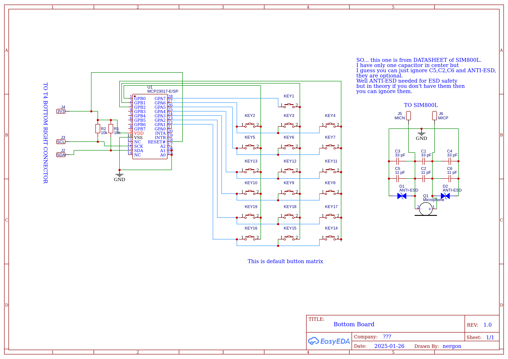
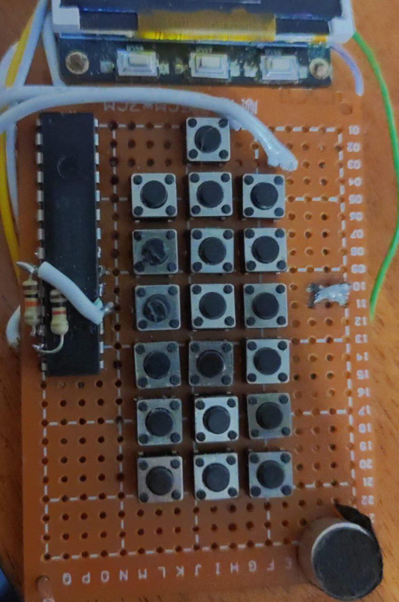
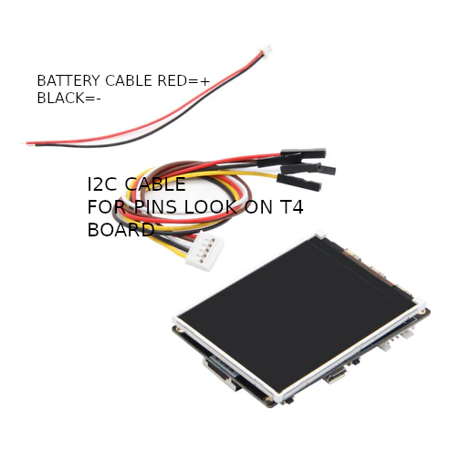
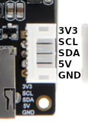
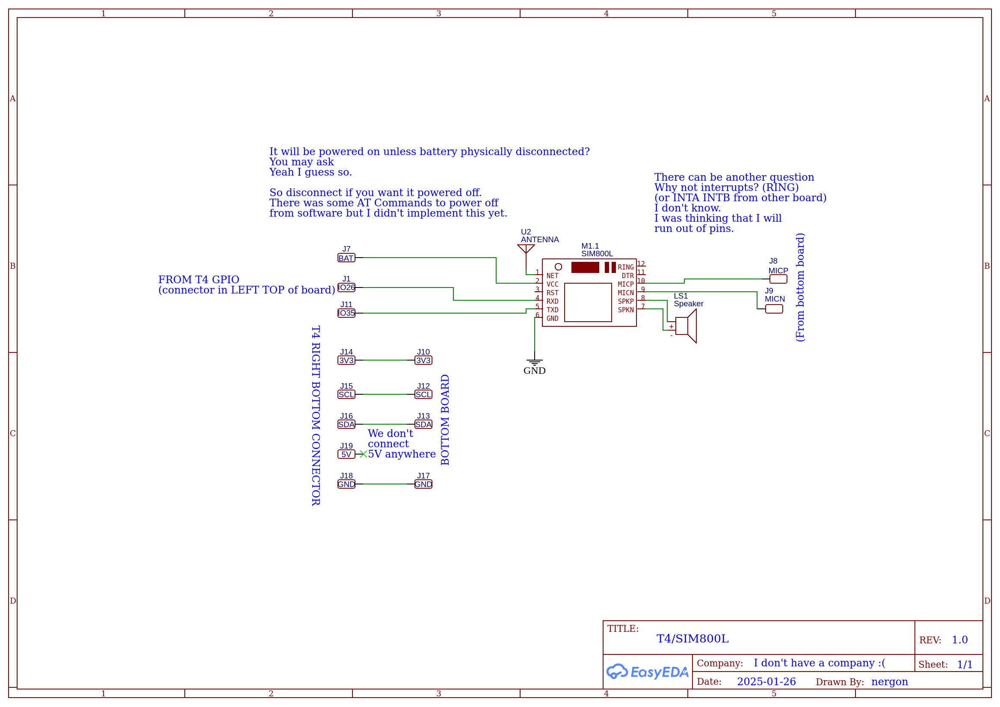
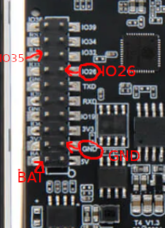

# Building device

Alright.
You looked at the main page and thought. Hell yeah! I want this phone for myself.

Very well. But this requires some knowledge of electronics.

# DISCLAIMER 

By working with the circuits, components, and batteries provided, you acknowledge and agree to the following:

 1. Risk of Damage: Electronics components, including but not limited to batteries and circuits, are susceptible to damage if handled improperly. Short circuits, incorrect wiring, and other mistakes can result in damage to your components or cause overheating, fire, or other hazards.

2. Battery Safety: Batteries can be dangerous if shorted or improperly handled. Overcharging, short circuits, or exposure to extreme temperatures can result in fire or leakage. Always follow manufacturer guidelines for safe handling.

3. Responsibility: Any actions taken with these components are your responsibility. If you make mistakes, including damaging circuits or components, I will not be held liable for any resulting consequences, including damage to property, injury, or data loss.

4. Use at Your Own Risk: You agree to use these components and follow instructions at your own risk. Always ensure you understand the circuit and components before powering them up. Seek advice or professional assistance if you are unsure.

## TL;DR
If you fuck up and something will go wrong because you don't have experience with this or something like that then it's not my responsibility.

(and yeah, I used AI to write this disclaimer)

If you don't have experience with arduino things, circuits and etc. Then you can call friend that can do this. If you don't have friends like that... well you can try build that, but be extremelly careful, battery shortage is not a joke.

Maybe guys in the Discord server can help.
At the moment when I writing this there is no one like that. Except me of course. 

## Building device itself

Considering that you ACKNOWLEDGED that disclaimer. You can continue

### Components

You need following components to build same device that I have.
	
1. LilyGo T4 [ Official Website ](https://lilygo.cc/products/t4) I bought it from local reseller (2.4 Inch variant)
2.  5x7 CM Universal Prototype one-sided board 
3.  19 buttons (I use 6x6mm tact switchs)
4.  SIM800L (It wouldn't work in countries where 2G network no longer available)
5.  MicroSD card (I guess any size from like 16 MB,though I never seen microsd card with capacity less then 1 GB. I use 16 GB. [Official documentation of ESP32 says that this thing have support up to 2TB sdcard](https://docs.espressif.com/projects/esp-faq/en/latest/software-framework/peripherals/sdio.html#what-is-the-maximum-capacity-for-esp32-sd-card))
6.  MCP23017 IC DIP and 2 resistors anywhere from 4.7k to 10k (I use 10k)
7. 3.7V mobile Li-Ion Battery (I use Nokia's BL-5C battery)
8. Wires
9. Soldering iron, solder,flux and other tools for assemble.
10. Small mobile speaker 8 Ohm or 32 Ohm (I'm actually not sure, but in theory both should work. I use 8 Ohm)
11. Capacitors (3 pcs of 33pF)
12. Electret Microphone
13. MicroUsb Cable (for charging and uploading firmware)
### Device assembly
	
 

Take a look at this schematic that I made.
Sorry for background being white.

There is no need to build keyboard this terrible. Maybe you'll do better job.

So placement of IC MCP23017 should be like on picture (Or whatever, there no real difference where you'll put it just do wiring properly, according to schematic)

And connect bottom board to T4 board using  I2C cable that comes with T4 board.

Look carefully where which pin is located
(It's actually written under port itself)

If you successfully connected Bottom board to T4 through I2C, proceed to next step.

Connecting SIM800L to board

When you connected SIM800L to board then time to solder the battery!

As I said in disclaimer and near disclamer and everywhere

__BE CAREFUL, BATTERIES ARE DANGEROUS__

solder red wire to + 

solder black wire to -

It's recommended to look for online tutorial how to solder them.

That's seems to be everything

Thank you for reading

To upload firmware proceed to [SOFTPART.MD](./SOFTPART.MD)

If you have any questions problems and etc.
see Contact info at [README/Contact](./README.md#contact)